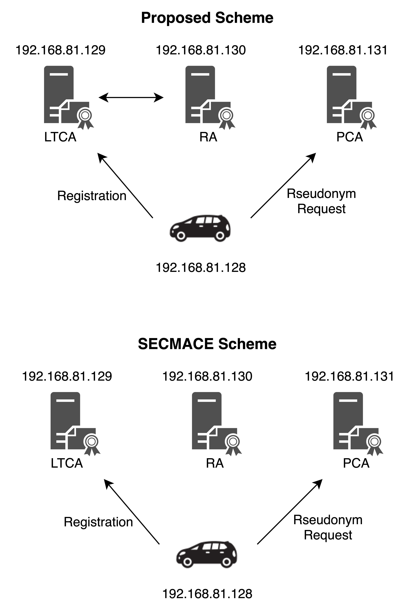

# ANSS-Project

## Implementation Structure

The main purpose of this implementation is to evaluate the latency introduced by the proposed scheme for the vehicle to acquire pseudonyms, I implemented the interaction of the vehicle with the VPKI entities in the registration process and the pseudonym acquisition process, focusing on the differences between the proposed scheme and the previous schemes, such as encryption-decryption and signatures. I did not implement the vehicle's process for acquiring a ticket, as both schemes have the same process in acquiring a ticket.

As shown in the figure, I used four virtual machines to implement different entities respectively, used EcDSA as the main signature scheme, added RSA as the encryption and decryption scheme, and used TLS as the communication channel. The proposed scheme mentions the use of group signatures is required, but there is no well-established implementation of the group signature scheme, so I replaced the steps that require group signatures with the use of EcDSA p-256 and evaluated the total delay by evaluating the signing and verification speeds of EcDSA and the experimental results in the paper [1]. Finally, estimate the time required for group signatures in this proposed scheme, and use this to evaluate the total delay.

## References

[1]	G. Calandriello, P. Papadimitratos, J.-P. Hubaux, and A. Lioy, “On the performance of secure vehicular communication systems,” IEEE transactions on dependable and secure computing, vol. 8, no. 6, pp. 898–912, 2010.